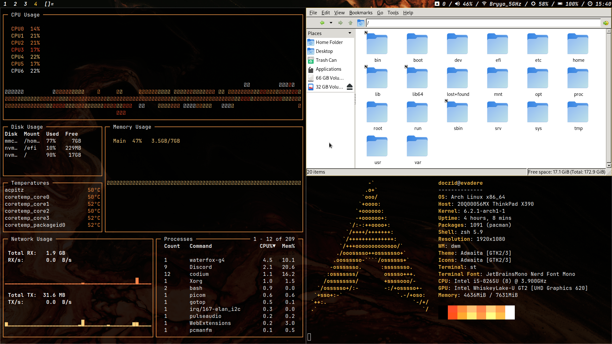

# evadere-dotfiles / Lava

Collection of dotfiles and other assets for the Arch Linux setup on my ThinkPad X390.

⚠️ **This is not a standalone setup** ***nor*** **is it a completely generic one - many things are specific to my own machine.** This may change in the future, though. ⚠️

- Wallpaper from https://unsplash.com/photos/YFlbfrxm4TM
- Window manager: [`evadere-dwm`](https://github.com/doczi-dominik/evadere-dwm)
- Status bar: [`evadere-bar`](https://github.com/doczi-dominik/evadere-bar)
- Terminal emulator: [`evadere-st`](https://github.com/doczi-dominik/evadere-st)

